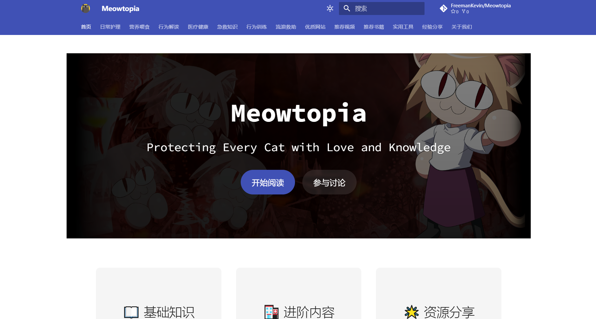

<p align="center">
  <a href="https://meowtopia.uk">
    
  </a>
</p>

<p align="center">
  <strong>
    A comprehensive cat care knowledge base built with
    <a href="https://www.mkdocs.org/">MkDocs</a>
  </strong>
</p>

<p align="center">
  <a href="https://github.com/FreemanKevin/Meowtopia/actions"></a>
  <a href="https://pypi.org/project/mkdocs-material/"></a>
  <a href="https://hub.docker.com/r/freelabspace/meowtopia"></a>
  <a href="https://github.com/FreemanKevin/Meowtopia/stargazers"></a>
  <a href="https://github.com/FreemanKevin/Meowtopia/blob/main/LICENSE"></a>
</p>

<p align="center">
  A comprehensive documentation site for cat care, covering everything from basic care
  to advanced medical knowledge. Built for both new and experienced cat owners.
</p>

<p align="center">
  <a href="https://meowtopia.uk">
    
  </a>
</p>

<p align="center">
  <em>
    Visit our website –
    <a href="https://meowtopia.uk">meowtopia.uk</a>
  </em>
</p>

## Quick start

```shell
# Clone the repository
git clone https://github.com/FreemanKevin/Meowtopia.git

# Install dependencies
pip install -r requirements.txt

# Start local development server
mkdocs serve

# Deploy to GitHub Pages
mkdocs gh-deploy
```

## Features

- 📚 **Comprehensive Content** - Covers basic care to advanced medical knowledge
- 🎨 **Beautiful Design** - Clean and modern interface with Material Design
- 🔍 **Full-text Search** - Fast and accurate search functionality
- 📱 **Mobile Friendly** - Responsive design for all devices
- 🌙 **Dark Mode** - Comfortable reading experience day and night
- 🚀 **Fast Loading** - Optimized for performance
- 🐳 **Docker Support** - Easy deployment with Docker

## Docker Support

### Using Docker Hub Image

```bash
# Pull and run the latest version
docker run -d -p 8000:8000 freelabspace/meowtopia:latest
```

### Using Docker Compose

```yaml
version: '3'
services:
  docs:
    image: freelabspace/meowtopia:latest
    ports:
      - "8000:8000"
    volumes:
      - .:/docs
    restart: always
```

## Project Layout

```
mkdocs.yml          # Configuration file
docs/
    index.md        # Homepage
    care/           # Basic care guides
    nutrition/      # Nutrition information
    health/         # Health and medical guides
    behavior/       # Behavior and training
    rescue/         # Rescue and adoption
    assets/         # Images and other assets
```

## Contributing

We welcome all contributions! Here's how you can help:

- 🐛 Report bugs by submitting a [GitHub issue](https://github.com/FreemanKevin/Meowtopia/issues)
- 📝 Submit PRs for bug fixes or new features
- 📖 Improve documentation
- ⭐ Star this repository if you find it helpful!

## Development

```bash
# Install development dependencies
pip install -r requirements.txt

# Run tests
pytest

# Check code style
flake8

# Format code
black .
```

## Acknowledgements

- [MkDocs](https://www.mkdocs.org/) for the documentation framework
- [Material for MkDocs](https://squidfunk.github.io/mkdocs-material/) for the beautiful theme